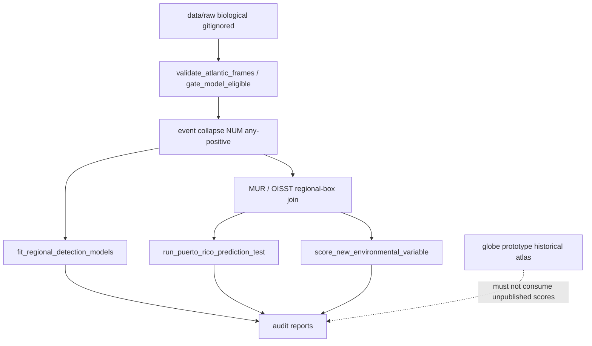

# Pipeline graph

Gates that are **not** wired into the live fit path: `gate_model_eligible.py` is a CLI/test only. `fit_regional_detection_models.py` does not call it.

Environmental join is a **regional daily mean**, not an event-location extract. All dives on a calendar date share one SST number.
