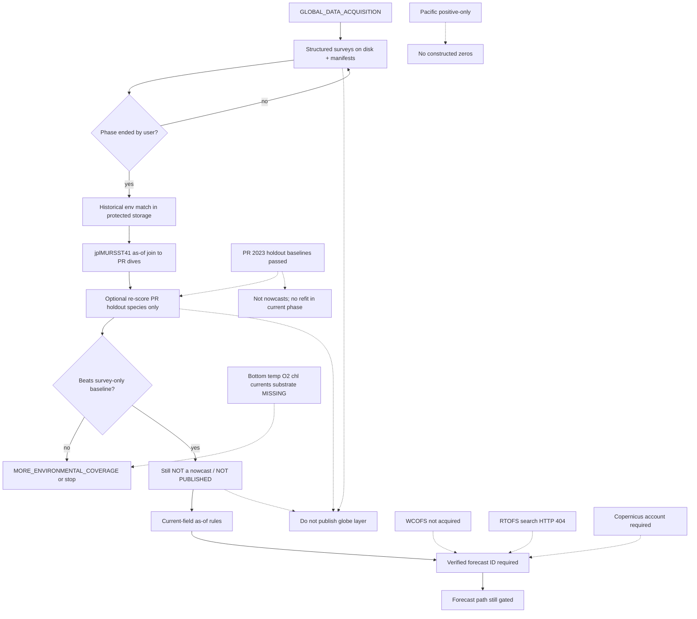

# Dependency graph

## Edge notes

| From | To | Rule |
|---|---|---|
| Acquisition | Historical env match | Scientific next step; **blocked for execution** while phase is acquisition |
| Historical SST join | Refit/re-score | Only after phase allows; only two PR species first; off-globe |
| Any internal pass | Globe publish | **No edge.** Publication is a separate gate |
| Missing predictors | Demersal/pelagic hypotheses | Remain `untested-in-this-repo` until IDs verified |
| Bias audit | Applied correction | **No edge** this phase |
